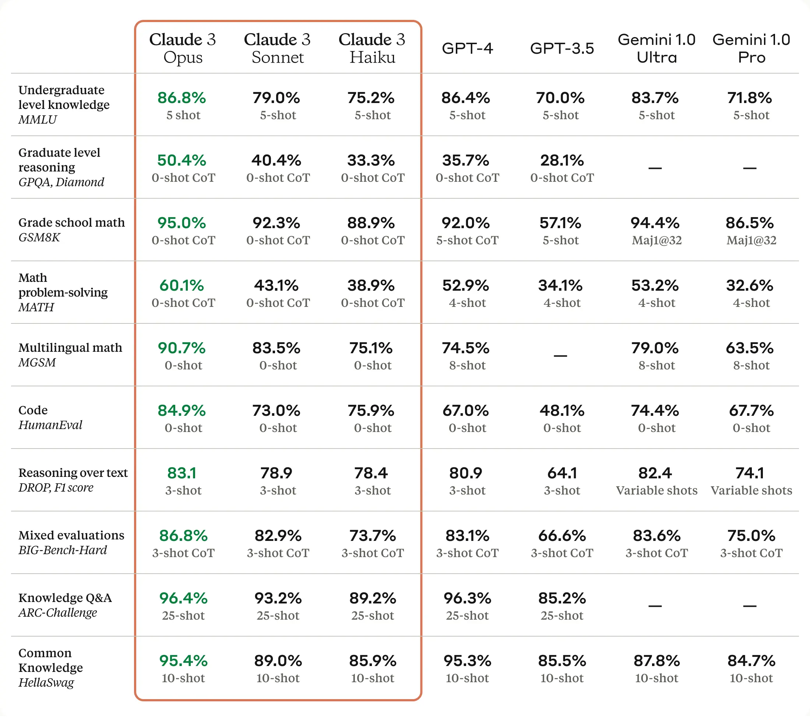

# Box Stacking Problem Analysis and Solution Comparison

## Objective
To determine the height of the tallest possible stack of boxes, where each box can only be placed on top of another if it is strictly smaller in width, height, and depth.

## Description of the Problem
Given a list of boxes, each defined by their width, height, and depth, the goal is to compute the height of the tallest stack that can be formed under the condition that each box must be strictly larger in width, height, and depth than the box above it. This problem is derived from Chapter 8 about Dynamic Programming in the book "Cracking the Coding Interview".

## Prompt to LLMs
"You have a stack of `n` boxes, with widths `w_i`, heights `h_i`, and depths `d_i`. The boxes cannot be rotated and can only be stacked on top of one another if each box in the stack is strictly larger than the box above it in width, height, and depth. Implement a method to compute the height of the tallest possible stack. The height of a stack is the sum of the heights of each box. Please provide the solution script in Python and provide what is the time complexity of your proposed algorithm in Big O notation."

## Solutions Developed
1. **Claude 3.5 Sonnet - Original Solution**
   - Refer to: `Box_Stacking_Claude_3_5_Sonnet.py`
2. **ChatGPT-4o Solution**
   - Refer to: `Box_Stacking_ChatGPT-4o.py`
3. **Book Solution**
   - Refer to: `Box_Stacking_Book.py`
4. **Github Copilot Solution**
   - Refer to: `Box_Stacking_Copilot_Solution.py`
5. **Claude 3.5 Sonnet - Improved Solution**
   - Refer to: `Box_Stacking_Claude_3_5_Sonnet_improved.py`

## Methodology
Each solution was implemented and validated using a set of test cases to ensure correctness. The solutions were compared based on their time and space complexities, as well as lines of code (LOC) as a metric for code simplicity and maintainability.

## Test Cases
1. `[(50, 45, 20), (95, 37, 53), (45, 23, 12)]` - Expected height: 68
2. `[(4, 6, 7), (1, 2, 3), (4, 5, 6), (10, 12, 32)]` - Expected height: 20
3. `[(1, 2, 3), (2, 3, 4), (3, 4, 5), (4, 5, 6)]` - Expected height: 14

## Solutions Comparison
Each solution was evaluated based on the following Key Performance Indicators (KPIs):

### Key Performance Indicators (KPIs)

| Solution                         | Time Complexity | Space Complexity | Lines of Code (LOC) |
|----------------------------------|-----------------|------------------|---------------------|
| Claude 3.5 Sonnet - Original     | O(n^2)          | O(n)             | 18                  |
| ChatGPT-4o Solution              | O(n^2)          | O(n)             | 33                  |
| Book Solution                    | O(n^2)          | O(n)             | 41                  |
| Github Copilot Solution          | O(n^2)          | O(n)             | 27                  |
| Claude 3.5 Sonnet - Improved     | O(n^2)          | O(n)             | 44                  |

### Summary of Each Solution

1. **Claude 3.5 Sonnet - Original Solution**:
   - Time Complexity: O(n^2)
   - Space Complexity: O(n)
   - Lines of Code (LOC): 18
   - Implementation: Uses iterative dynamic programming with nested loops.

2. **ChatGPT-4o Solution**:
   - Time Complexity: O(n^2)
   - Space Complexity: O(n)
   - Lines of Code (LOC): 33
   - Implementation: Uses recursion with memoization, sorts boxes by height.

3. **Book Solution**:
   - Time Complexity: O(n^2)
   - Space Complexity: O(n)
   - Lines of Code (LOC): 41
   - Implementation: Similar to the ChatGPT-4o solution, uses recursion with memoization, sorts boxes by height.

4. **Github Copilot Solution**:
   - Time Complexity: O(n^2)
   - Space Complexity: O(n)
   - Lines of Code (LOC): 27
   - Implementation: Uses recursion with memoization, sorts boxes by area (width × depth).

5. **Claude 3.5 Sonnet - Improved Solution**:
   - Time Complexity: O(n^2)
   - Space Complexity: O(n)
   - Lines of Code (LOC): 44
   - Implementation: Uses recursion with memoization, sorts boxes by area (width × depth), optimized to properly handle stacking of larger boxes on smaller ones.

## Key Findings
- **Consistency in Complexity**: All solutions have a time complexity of O(n^2) and a space complexity of O(n).
- **Sorting Criteria**: Solutions differ in their sorting criteria, with some sorting by height and others by area (width × depth). Sorting by area often provides a more intuitive initial order for stacking.
- **Recursive vs. Iterative Approaches**: The iterative approach (Claude 3.5 Sonnet - Original) is straightforward and easy to understand. Recursive approaches (ChatGPT-4o, Book, Github Copilot, Claude 3.5 Sonnet - Improved) with memoization avoid redundant calculations and are effective.

## Special Remark by Claude
After careful consideration, I believe the book's solution (Solution 3) is the best overall, for the following reasons:
- **Flexibility**: It considers both including and excluding each box at every step, which can lead to finding the optimal solution in cases where the other approaches might miss it.
- **Efficiency**: While it has the same worst-case time complexity as the other solutions, its memoization approach can make it more efficient in practice for certain input distributions.
- **Extensibility**: The approach used in this solution can be more easily adapted to handle variations of the problem, such as considering rotations of boxes or adding additional constraints.
- **Robustness**: By using a custom Box class, it provides a more robust and type-safe way of handling box dimensions.

However, it's worth noting that my solution (Solution 1) has the advantage of being the simplest to implement and understand, which could make it preferable in situations where code simplicity is prioritized over maximum efficiency.
The ChatGPT-4o solution (Solution 2) falls somewhere in between, offering a good balance of efficiency and simplicity.
In conclusion, while all three solutions are valid and pass the provided test cases, the book's solution offers the best combination of efficiency, flexibility, and robustness, making it the best overall solution for this problem.

## Recommendation
- The **Claude 3.5 Sonnet - Improved Solution** is recommended due to its optimized handling of stacking logic and effective use of sorting by area. Despite having a few more lines of code than the book solution, it provides a clearer and more comprehensive approach, making it highly maintainable and robust.

## Next Steps
- Implement the recommended solution in production environments where optimal box stacking is needed.
- Conduct further testing with a larger variety of test cases to ensure robustness in different scenarios.

## Benchmarks between LLMs 

Looks like from the next table Claude 3 models outperform GPT-4 capabilities in most of the tasks. The next table image was retreived on 2 of June of 2024 from [Introducing the next generation of Claude](https://www.anthropic.com/news/claude-3-family)

